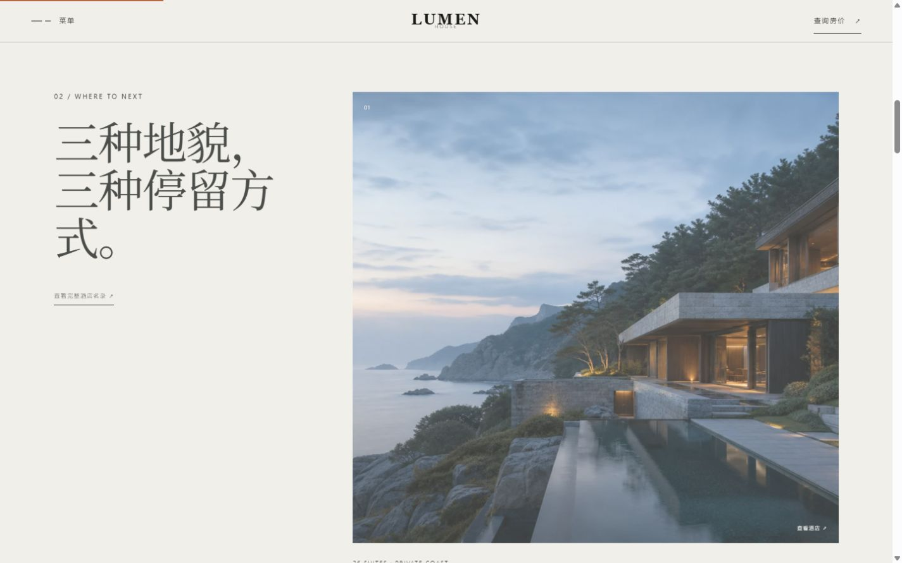
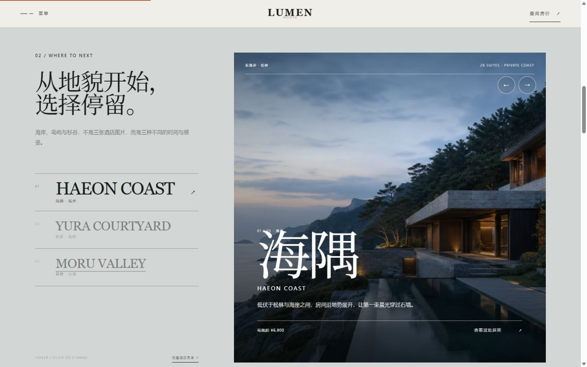
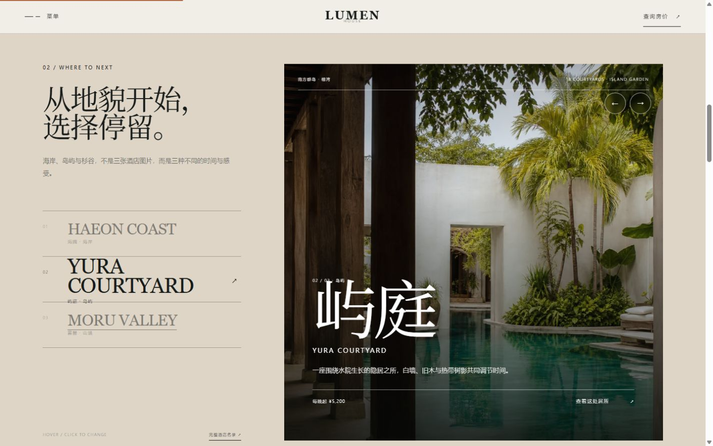
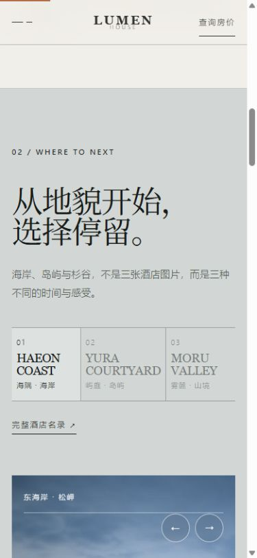

# 实操作业提交：Lumen House 目的地展示视觉优化

## 网站链接

https://xingyu158513.github.io/lumen-house/

## 网站面向谁

网站面向重视建筑设计、自然环境和安静节奏，正在比较精品度假酒店的旅行者，包括情侣、独行者和小家庭。

## 网站想表达什么

核心表达是“让酒店退后，让地方发生”。Lumen House 不想用同一种豪华复制不同目的地，而是让海岸、岛屿、杉谷和当地时间成为停留的主角。

## 本次选择的问题

原网站整体已经具有较好的摄影、留白和酒店编辑感，因此本次没有继续在首屏增加装饰，而是选择首页“三处居所”模块作为具体问题。

调整前，三处酒店使用相同结构的大图卡片向下排列。图片具有吸引力，但三种地貌的差别需要逐张阅读，视觉权重重复，用户也无法在同一画面中确认当前选择。

## 调整前

- 三处酒店以重复卡片排列。
- 海岸、岛屿与杉谷只是卡片标签，没有成为页面的选择逻辑。
- 用户需要较长滚动才能完成比较。
- 操作反馈只有图片轻微放大。

## 调整后

- 将重复卡片改成“目的地索引＋当前主场景”。
- 当前地点通过字号、颜色和位置成为视觉主角，其他地点保持为可比较的次级选项。
- 海岸、岛屿和杉谷分别使用蓝灰、砂岩和苔绿色调。
- 图片、标题、说明、价格和行动入口随选择同步切换。
- 点击“查看这处居所”后才进入详情页，选择与跳转被分成两个清楚步骤。

## 交互反馈

当用户移动或点击“YURA COURTYARD”时，左侧选中层级、页面底色、右侧图片和全部酒店信息会同步变化。动效不是单纯装饰，而是用来说明当前选择已经改变。

## 可读性二次校准

在目的地结构调整完成后，又根据实际观看反馈提高了全站小字下限：正文统一为 `16–17px`，标签为 `11px`，按钮和功能文字为 `12px`。手机端没有简单等比缩小，而是继续保持 `16px` 正文，并单独校正三个目的地标签的字号与字距。

## 调整结果

第一次进入这个模块的用户，现在可以在同一个画面中理解三处居所的差异，确认当前地点，并知道下一步会进入哪一家酒店。优化同时对应了内容表达、视觉层级、留白、对比度和交互反馈，并且保留了网站原有的高端酒店设计语言。

## AI 迭代说明

早期方案曾尝试在首屏增加深色中文信息卡，但它破坏了原有留白与摄影感，因此被明确记录为失败方案并撤销。本次从更早的信息结构问题出发，把视觉优化落在目的地选择模块，再通过小字校准解决真实阅读反馈。完整过程见[迭代 004](iterations/iteration-004-first-visit-message.md)、[迭代 005](iterations/iteration-005-typographic-integration.md)、[迭代 006](iterations/iteration-006-place-selector.md)和[迭代 007](iterations/iteration-007-readable-small-type.md)。

