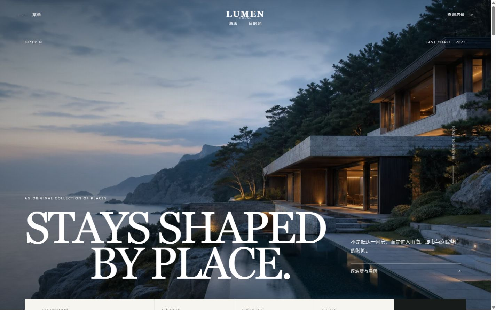
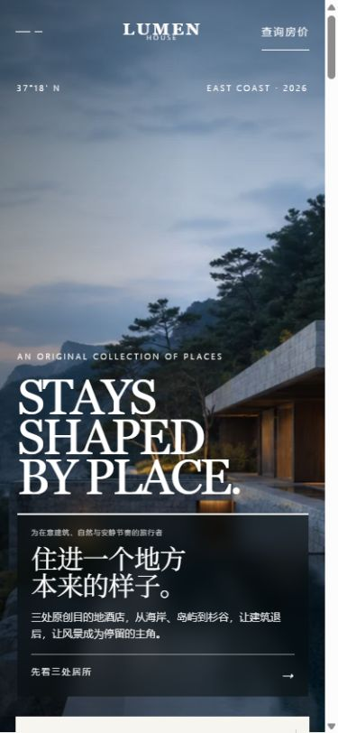

# 迭代 004：把“给谁、表达什么”放进第一眼

日期：2026-08-22

> 结果状态：本方案随后被用户否决。它解决了“信息不可见”，但新增的深色信息卡破坏了原有酒店编辑感，并造成中英文争夺主视觉。截图与判断保留为失败证据，修正见[迭代 005](iteration-005-typographic-integration.md)。

## 目标

把第 003 轮只在操作后出现的反馈改进保留下来，同时修复一个更适合作业展示的问题：首次访问者进入首页时，能够在首屏直接看到网站面向谁、核心主张是什么，以及接下来应该点击哪里。

## 用户反馈与问题归因

用户明确指出上一轮变化几乎不可见，也难以通过截图展示。原因是第 003 轮主要修改了点击后的状态与数据延续，首页静止画面没有形成明显的前后差异。

更早的问题位于内容层级：首屏最大的内容是英文 `STAYS SHAPED BY PLACE.`，中文说明只有一段较小的辅助文字。中文首次访问者能感受到酒店氛围，却不一定能迅速回答：

1. 这是给谁的？
2. 这个品牌和普通酒店有什么不同？
3. 下一步应该看什么？

## 受众与核心表达

- 服务对象：重视建筑、自然环境和安静节奏，正在比较精品度假酒店的旅行者。
- 核心表达：**住进一个地方本来的样子。** 酒店退后，让风景和当地节奏成为停留的主角。

## 调整前

- 英文氛围标题占据绝对主导。
- 中文只有约一段正文大小，没有明确说出目标人群。
- 行动文字“探索所有居所”存在，但和品牌主张的关系较弱。
- 静态截图很难证明网站已经针对受众和核心表达完成调整。

## 调整后

- 在首屏右侧增加高对比度中文信息层，明确写出目标人群。
- 将“住进一个地方本来的样子”提升为中文核心标题。
- 用一段短说明解释海岸、岛屿、杉谷与“建筑退后”的品牌差异。
- 将行动改为“先看三处居所”，让首次访问者知道点击后会看到什么。
- 英文标题由最大 138px 收至最大 118px，保留气质但不再压过中文信息。
- 中文信息使用独立留白、顶部强调线与半透明深色底，确保复杂照片上仍然清晰。

## 移动端结果

移动端将中文信息层放在英文标题下方，目标人群、主张、说明和行动均保持在首屏内，没有横向溢出。

## 依据与证据等级

- A：用户直接反馈“看不到改进地方、无法展示前后变化”。
- B：1440×900 调整前后截图，以及 390×844 移动端截图。
- B：浏览器可见文本与控制台检查，目标人群、中文主张和行动链接均存在，控制台无错误或警告。
- C：首次访问的信息顺序应先回答“与我是否有关”，再解释价值，最后给出低压力下一步。

## 验证结果

- 1440×900：英文标题与中文信息层互不遮挡；中文主张位于首屏并具有独立对比度。
- 390×844：四层信息完整出现，无横向溢出。
- 浏览器控制台：无 error 或 warning。
- `npm run lint`、`npm run build`、`npm run build:pages`：通过。

## 遗留项

- 本轮只调整首屏信息层级，没有扩大到其他页面，便于作业把问题与解决方案一一对应。
- 第 003 轮的预订反馈仍保留，但在本次作业说明中作为次要改进，不作为主要前后截图依据。

