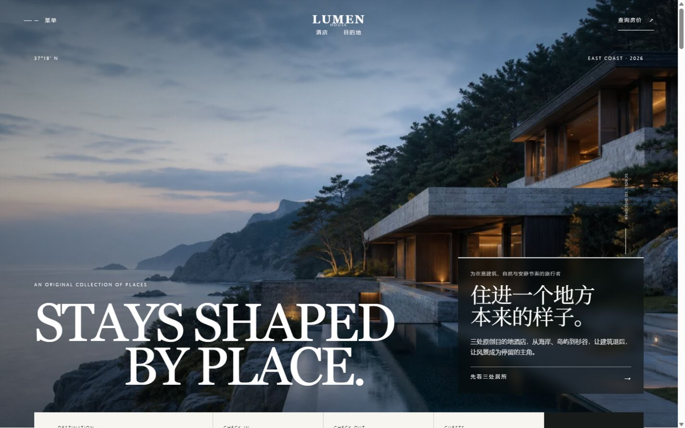
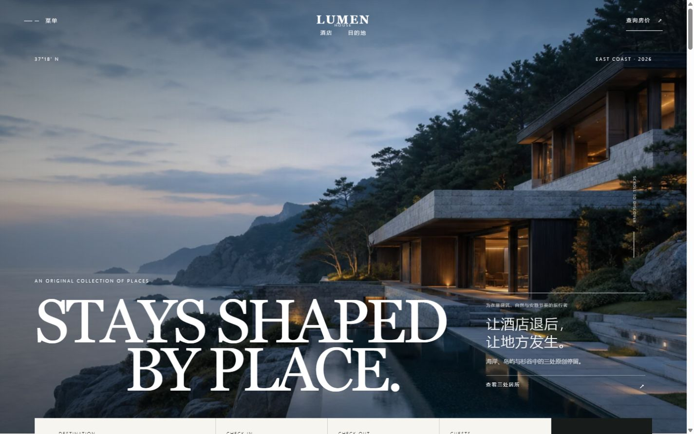
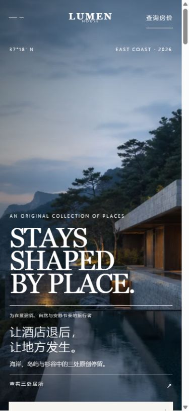

# 迭代 005：把中文重新融入原有设计语言

日期：2026-08-22

## 目标

回应用户对第 004 轮的直接否定：修复字体排布，让受众、核心表达和行动仍然可见，但不再用额外信息卡破坏原本依靠大图、留白、细线与大字号英文建立的高端酒店编辑感。

## 修改前现状

第 004 轮把中文内容放进半透明深色卡片，形成了以下问题：

1. 卡片像后加的功能模块，与全屏照片和透明留白不是同一种设计语言。
2. 中文标题使用西文衬线字体的回退字形，中文字面与英文主标题关系生硬。
3. 中文标题、说明、受众标签和行动同时被强化，层级过多。
4. 英文标题被缩小到最大 118px，却仍与大号中文标题争夺同一区域。

## 参考依据与证据等级

- A：用户直接反馈“字体的排布有问题”“加得很奇怪”“把原本高级的设计感毁坏了”。
- B：第 004 轮桌面端截图可见独立深色矩形，与原始无底色编辑式排版形成明显冲突。
- B：1440×900 与 390×844 浏览器实测，修正后无横向溢出；手机端中文区与预订栏保留 23px 间距。
- C：在摄影主导的精品酒店首屏中，主视觉应保持单一，辅助信息通过字号、字重、细线和位置形成层级，而不是再制造一个高对比度容器。

## 迭代理念

这轮不是继续“加一个更漂亮的组件”，而是撤销错误的视觉容器，让内容回到原有构图。英文负责远距离气质识别，中文负责近距离解释，两者不再同时充当主标题。

## 设计

- 保留左下大号英文 `STAYS SHAPED BY PLACE.` 作为唯一主视觉。
- 中文回到右侧负空间，沿用原版的细横线与透明背景。
- 核心表达缩短为“让酒店退后，让地方发生。”，去掉长句造成的断行压力。
- 中文标题改用 Noto Sans SC 的 300 字重，桌面端控制在 23–29px，避免用西文衬线回退字形。
- 受众标签、核心表达、短说明、行动依次降低层级；不使用阴影卡片、模糊背景或容器投影。
- 移动端改为英文在前、中文在后的单轴阅读，保留照片可见面积，并仅用轻微文字阴影抵抗复杂背景。

## 实现方法

- 删除 `.hero-message` 的半透明背景、`backdrop-filter`、投影、内边距块和 2px 强调线。
- 恢复英文标题的视觉规模，最大字号由 118px 调整为 132px。
- 将中文标题从 `var(--serif)` 改为 `var(--sans)`，使用 300 字重、1.28 行高和小幅字距。
- 将说明压缩为“海岸、岛屿与杉谷中的三处原创停留。”，行动改为“查看三处居所”。
- 为 560px 以下视口单独校准字号、行高、文字对比度与底部间距。

## 修改后

修正版没有新增视觉模块。中文仍能回答“面向谁、表达什么、下一步是什么”，但它退回为英文主视觉的解释层，照片、留白与版式重新成为整体。

## 移动端结果

390×844 下英文、中文和行动按单一纵向顺序排列；页面无横向溢出，中文信息区底部与预订栏顶部相距 23px。

## 验证结果

- 1440×900：无信息卡、无横向溢出，中英文视觉层级分明。
- 390×844：内容完整、无横向溢出，预订栏不遮挡行动入口。
- 首屏入场动画完成后 `.hero-message` opacity 为 1。
- 浏览器控制台：无 warning 或 error。
- `npm run lint`、`npm run build`、`npm run build:pages`：全部通过；GitHub Pages 构建所需页面均为静态输出。

## 遗留项与下一步

- 本轮只修正被用户明确指出的首屏字体与视觉整合问题，不扩散修改其他页面。
- 若后续继续优化，应以真实首次访问测试判断文案理解度，不能再通过增加高对比度组件来替代信息取舍。

