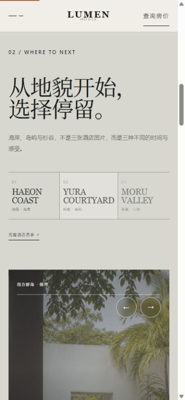
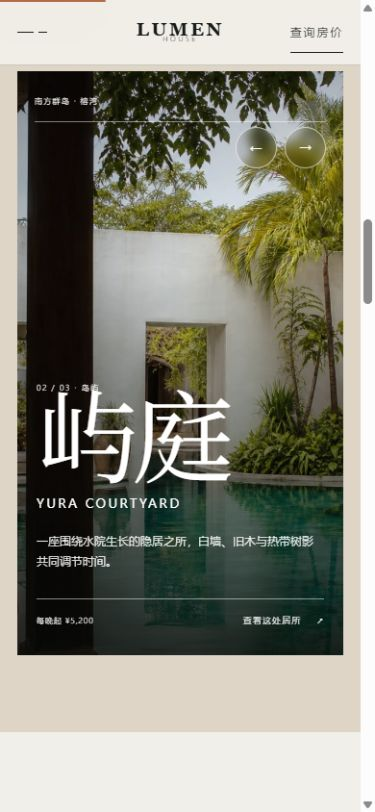

# 迭代 006：把酒店列表改成地貌选择器

日期：2026-08-22

## 目标

完成一次真正可见、同时有内容依据的视觉设计优化。首屏本身已经具有较完整的摄影、留白和品牌气质，因此不再继续堆叠首屏元素；本轮改造首页 `02 / WHERE TO NEXT`，让“酒店因地方而生”的品牌表达直接体现在页面结构与交互反馈中。

## 修改前现状

- 三处酒店以相同结构的大图卡片依次向下排列。
- 图片本身优美，但海岸、岛屿与杉谷的区别只能逐张阅读。
- 三张卡片权重接近，没有明确的“当前选择”。
- 用户需要滚动较长距离才能完成比较，视觉节奏重复。
- 交互主要是图片轻微放大，没有把用户操作转化为明确反馈。

## 参考依据与证据等级

- A：用户明确要求这次作业体现视觉设计优化，并指出字体微调不足以支撑作业展示。
- A：用户要求先实现并直接查看效果，而不是继续抽象讨论。
- B：调整前 1440×900 截图显示该模块是长距离重复卡片结构。
- B：调整后桌面与 390×844 移动端实测，三处目的地状态均可切换，无横向溢出。
- C：品牌核心是“让酒店退后，让地方发生”，所以目的地地貌应成为选择入口，而不是只作为卡片标签存在。

## 迭代理念

视觉优化不等于增加装饰或让动画单独表演。这里先改变信息组织：同一时刻只保留一个主场景，其他地点成为可比较的选择。动效只负责解释状态发生了变化。

## 设计

### 桌面端

- 左侧建立三处目的地索引，当前地点扩大字号并提高对比度，其他地点保持次级状态。
- 右侧只显示一个大型主场景，承载当前地点的图片、中文名、英文名、说明、价格和行动入口。
- 海岸、岛屿、杉谷分别使用蓝灰、砂岩、苔绿的页面底色。
- 悬停、点击、键盘方向键或主场景箭头都可以改变当前地点。
- 切换时图片淡入并轻微推进，文字错峰进入；最终按钮才进入详情页。

### 移动端

- 三处选择压缩为并列索引，点击后更新下方主场景。
- 主场景改为竖向画幅，保持酒店名称、说明、价格和行动在同一视口内。
- 保留上一处、下一处按钮，适合触屏操作。

## 实现方法

- 新增 `DestinationSelector` 客户端组件，统一管理当前地点状态。
- 使用语义化 `tablist`、`tab` 和 `tabpanel` 表达选择关系，并提供 `aria-selected` 与可读标签。
- 使用同一份酒店数据同步驱动图片、标题、地点、说明、价格和链接，避免视觉状态与内容状态分离。
- 通过 CSS 自定义色调、图片与文字入场动画实现状态反馈，并支持 `prefers-reduced-motion`。
- 固定桌面端选择行高度，避免切换时列表产生布局跳动。

## 修改后

三处酒店不再是三张连续卡片。当前地点成为唯一主视觉，用户在一个模块内即可理解、比较和进入下一步。

## 第二种状态

切换到屿庭后，页面底色、选中层级、图片、名称、说明、价格和行动全部同步变化，这就是本轮交互反馈的核心。

## 移动端

## 验证结果

- 1440×900：当前地点、其他选项和主场景层级清楚；无横向溢出。
- 390×844：索引与主场景均无横向溢出，触屏箭头可以切换到下一处地点。
- 已验证海岸、岛屿、山境三种状态分别更新图片、文本与背景色。
- 浏览器控制台无 warning 或 error。
- `npm run lint`、`npm run build`、`npm run build:pages`：全部通过，页面可静态发布。

## 遗留项与下一步

- 本轮只重构一个模块，便于作业把问题与解决方案一一对应，没有借机重做其他页面。
- 详情按钮目前进入统一的酒店详情示例页；如果将来扩展为真实产品，可以再为三处酒店增加独立详情路由。

