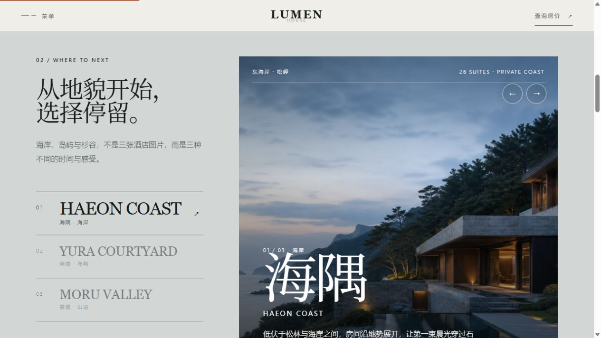

# 迭代 007：提高全站小字可读性

## 目标

解决全站说明文字、导航、标签、按钮和图片内辅助信息偏小的问题。在保留酒店编辑式留白和字距的前提下，让桌面端与手机端首次访问者无需费力辨认文字。

## 修改前现状

- 多处辅助文字只有 `7–9px`，在普通显示器和手机屏幕上容易变成装饰性灰线。
- 正文下限约为 `14–15px`，中文段落的阅读压力偏高。
- 目的地选择器虽然层级明确，但地点、状态、价格等次级信息没有足够可读性。
- 字号分散在不同组件中，继续逐项修改容易产生新的不一致。

## 参考依据与证据等级

- 用户直接反馈“整体小字的大小太小”：最高优先级的一手使用反馈。
- 浏览器计算样式测量：修改前的微型信息大量落在 `7–10px`；高可信的实现证据。
- 1280px 桌面与 390px 手机实页检查：高可信的视觉与响应式证据。

## 迭代理念

不是把所有文字一起放大，而是提高底层字号下限：标题保持原有视觉比例，正文、标签、控制文字和辅助信息分别进入稳定的字号层级。这样既提升阅读性，也不会把页面改成普通信息网站。

## 设计

- 正文：统一到 `16–17px`。
- 功能文字与按钮：统一到 `12px`。
- 标签和编号：统一到 `11px`。
- 辅助说明：统一到 `12px`。
- 手机端正文保持 `16px`，目的地说明保持 `15px`，三个地点的次级信息提高到 `11px`。
- 适当收紧手机端次级信息字距，避免字号增加后挤压列宽。

## 实现方法

- 在 `app/globals.css` 建立 `--type-body`、`--type-label`、`--type-control`、`--type-meta` 与 `--type-caption` 五个语义字号变量。
- 将导航、按钮、标签、图像编号、页脚、表单、预订反馈和目的地选择器统一映射到这些变量。
- 单独修正首屏中文说明、酒店正文和移动端目的地标签，避免旧规则覆盖新的字号体系。

## 修改后效果

### 桌面端

正文计算字号为 `16px`，标签为 `11px`，主要控制文字为 `12px`，首屏中文短说明为 `15px`。

### 移动端

390px 视口中没有横向溢出；正文为 `16px`，目的地说明为 `15px`，地点次级标签为 `11px`。

## 验证结果

- `npm run lint`：通过。
- `npm run build`：通过。
- 1280px 桌面实页：无横向溢出，标题与小字层级仍然清楚。
- 390px 手机实页：无横向溢出，三个地点仍在同一行，文字没有互相覆盖。

## 遗留项

- 英文全大写标签仍保留较宽字距，这是品牌编辑感的一部分；如果课堂投影距离较远，可以在演示版中再单独提高一级。
- 站内部分超小文字属于品牌字标，不与正文采用同一可读性标准。

## 下一步

以真实课堂投影或提交截图为准，再判断是否需要制作“演示模式”字号；没有新的阅读证据时不继续无意义放大。

